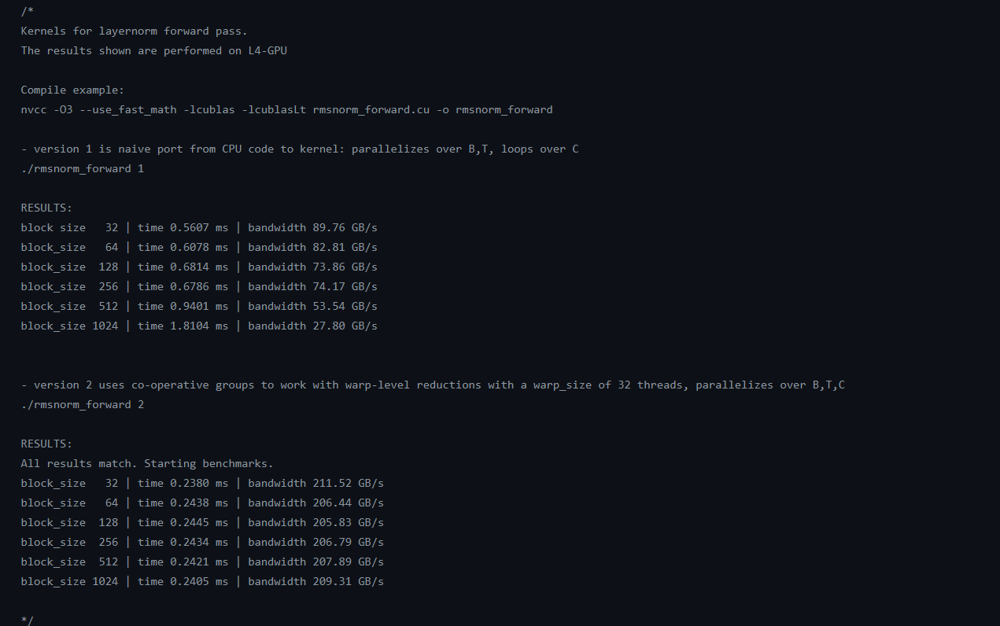

# llama.c

llama.c is an extension of the work done in [llm.c repo](https://github.com/karpathy/llm.c). I have utilizes the implementation of llm.c and tried to replicate the functionality from gpt2 architecture to [llama architecture](https://scontent.fisb13-1.fna.fbcdn.net/v/t39.2365-6/453304228_1160109801904614_7143520450792086005_n.pdf?_nc_cat=108&ccb=1-7&_nc_sid=3c67a6&_nc_ohc=Ckhh9hWw6wAQ7kNvgHcLqAT&_nc_ht=scontent.fisb13-1.fna&oh=00_AYD_c4xeIWTV8kBydiZ_spllRSQSzw5f-ks43_E1lOybUg&oe=66CE0EC7).

The major changes in the LLaMA architecture(compared to GPT2 architectures) are as:

- Layernorm is replaced by RMSNorm (Root Mean Square)
- The absolute Positional information is replaced by RoPE (Rotary Positional Encoding)
- The simple MHA is replaced by GQA Variant
- The GeLU FFN network is replaced as SwiGLU FFN network.

For detailed information about the major architecture changes, and sound understanding of the LLaMA architecture, visit the linked Paper.

- A very nice blog post for understanding LLaMA architecture and understanding its key components (which I found quite helpful) is [here](https://levelup.gitconnected.com/building-a-million-parameter-llm-from-scratch-using-python-f612398f06c2#f469)

## Changes made:

I have followed the traditional approach used by **llm.c team** about addding nice and clean code about the kernels. All the new-kernels added can be found in `llm.c/dev/cuda` directory. A brief note about the changes are as follows:

**NOTE:** For each layer, I have also added the simple CPU implementation of the layer from the reference PyTorch Implementation given in `train_llama3.py`. Along with CPU implementation, a naive GPU kernel (mimicked from their reference CPU implementation) are also added.
After creating naive parallelized GPU Kernels, I have decided to move towards advanced CUDA Performance Optimization techniques to get better perf. The CUDA Technique and its performance optimization results are added in the the comment at the top of each `.cu` file. For example, for rmsnorm, you can visit `rmsnorm_forward.cu`, and you will find the script to execute the kernel. Along with scripts compilation, I have added results, as showed in the attached screenshot below:



I have used T4 (Tesla) GPU to calculate Performance and Performance Optimization after for every kernel.

### RMSNorm

- Added 2 GPU Kernels for the each forward and backward pass.
- The two kernels in both the files share the same nature. The First one is naive translation of CPU Code, and the second one is optimized Kernel created using **cooperative-groups**.
- Achieved Performance gain from `time 0.5607 ms` to `time 0.2380 ms` in forward pass, and `time 3.4939 ms` to `time 0.3957 ms` in backward-pass, with the `block_size=32`.

### apply_rope

- Added 3 GPU kernels for forward and 2 for backward pass.
- Utilized Coalesced Memory access, controlled warp-divergence, and Shared Memory access for developing the kernels.
- The best perf obtained is using kernel-1 (the simple CPU conversion utilizing coalescing memory accesses).

  **NOTE:** The kernel was found to Memory-Bandwidth bound, so it was limited by GPU memory bandwidth, and thus no significant performance gains. Although, we can try using efficient load/store operations to improve performance

### precompute_cis:

- Added 2 GPU Kernels for precomputing the `cis` component to be used for RoPE.
- Utilized simple Coalesced Memory accesses to better the performance.
- Improved Perf from `time 0.0410 ms` to `time 0.0098 ms` for the `block_size=32`

### SwiGLU

- Added 2 GPU Kernels for the each forward and backward pass.
- The two kernels in both the files share the same nature. The First one is naive translation of CPU Code, and the second one is optimized Kernel created using uses `bfloat16` with the _Packed128_ data structure which helps in faster **load/store** operations.
- Achieved Perf from `time 0.2018 ms` to `time 0.1711 ms` in forward pass, and `time 0.3049 ms` to `time 0.2900 ms` in backward-pass, with the `block_size=32`.

### repeat_kv

- Added 2 GPU kernels for each forward and backward pass.
- Utilized Coalesced Memory access for developing the kernels, and get better perf.
- The best Perf obtained is using kernel-2 (utilizing coalescing memory accesses to get more parallelization).
- Improved Perf from `time 0.3275 ms` for the `block_size=32`, to `time 0.3202 ms` (a hard-coded block_size (=head_dim))
  **NOTE:** The kernel was found to Memory-Bandwidth bound, so it was limited by GPU memory bandwidth, and thus no significant performance gains. Although, we can try using efficient load/store operations to improve performance

### Attention GQA:

- Integrated `repeat_kv`and `apply_rope` into already optimized MHA implementaion (added by **llm.c team**) to perform Attention-GQA Operations.
- Changed the implementation of `permute_kernel` used in previous MHA (since the K,V shapes were changed from `[B,T,NH,HS]` to `[B,T,num_kv_heads, HS]`)
- Utilizes cuBLAS for compute heavy parts (added by **llm.c team**).
  **NOTE:** Currently having issues regarding this integration. Will be fixing it soon.

## quick start (1 GPU, fp32 only)

I haven't added support for multi-GPU, just focused on implementing the GPU kernels for pre-trainig LLaMA. Following the structure of **llm.c**. I have added necessary changes in our Makefile and starter for starting pre_training for our little LLaMA3.

NOTE from llm.c team about single GPU FP32 version:

- If you won't be training on multiple nodes, aren't interested in mixed precision, and are interested in learning CUDA, the fp32 (legacy) files might be of interest to you. These are files that were "checkpointed" early in the history of llm.c and frozen in time. They are simpler, more portable, and possibly easier to understand.

Run the 1 GPU, fp32 code like this:

```bash
chmod u+x ./dev/download_starter_pack.sh
./dev/download_starter_pack.sh
make train_llamafp32cu
./train_llamafp32cu
```

The download_starter_pack.sh script is a quick & easy way to get started and it downloads a bunch of .bin files that help get you off the ground. These contain: 1) the GPT-2 124M model saved in fp32, in bfloat16, 2) a "debug state" used in unit testing (a small batch of data, and target activations and gradients), 3) the GPT-2 tokenizer, and 3) the tokenized [tinyshakespeare](https://raw.githubusercontent.com/karpathy/char-rnn/master/data/tinyshakespeare/input.txt) dataset. Alternatively, instead of running the .sh script, you can re-create these artifacts manually as follows:

```bash
pip install -r requirements.txt
python dev/data/tinyshakespeare.py
python train_gpt2.py
```

# Next-Up

- Integrating it correctly in `train_llama_fp32.cu` file, and starting pre-training for LLaMA3 (all calculations in `fp32`) 🎉🙌
- Profiling for LLaMA to check for the GPU utilization 🚀

## datasets

The data files inside `/dev/data/(dataset).py` are responsible for downloading, tokenizing and saving the tokens to .bin files, readable easily from C. So for example when you run:

```bash
python dev/data/tinyshakespeare.py
```

We download and tokenize the [tinyshakespeare](https://raw.githubusercontent.com/karpathy/char-rnn/master/data/tinyshakespeare/input.txt) dataset. The output of this looks like this:

```
writing 32,768 tokens to ./dev/data/tinyshakespeare/tiny_shakespeare_val.bin
writing 305,260 tokens to ./dev/data/tinyshakespeare/tiny_shakespeare_train.bin
```

The .bin files contain a short header (1024 bytes) and then a stream of tokens in uint16, indicating the token ids with the GPT-2 tokenizer. More datasets are available in `/dev/data`.

